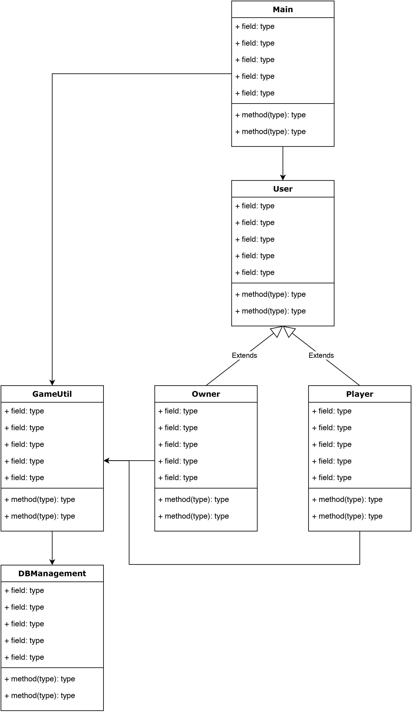

CS375-1 APP1: Functional Specification & Schedule Document
===========================================================

# Group Members:
Griffen Marler, Rudyjay Keopuhiwa, Levi Russell

# Project Description

Treasure hunt application.

Our project plans to utilize camera functionality, location services, and user moderation in order to create a treasure hunt game. We are going to look into using google maps API to help us track location and pinpoint specific areas on the map. This application will allow a host user to create their own treasure hunt which their friends can then participate in. The game rules and layout will be fully customizable by the host of the game. These cutomizations may include things such as trivia questions at each location, specific pictures that need to be uploaded, and other location based tasks. The host can also include to leave location services out of the game. During the game, the host must verify if the users complete the tasks correctly. For example, if the host wants the player of their game to send them a picture of a specific building on Whitworth's campus, the host will receive the image of the building through the application and either approve or reject this task. 

We plan on using Dart and Flutter to build out our treasure hunt game. We believe we will need database storage to store relevant information for each game. We are considering using Google Firestore services or GitHub's database services. We are excited to experiment with transferring photos from the camera to our database, as well as experimenting with location services. We will rely on the database to connect everyone together in the game because we do not think bluetooth would satisfy our needs. 

We decided to work on the treasure project to challenge ourselves by experimenting with location services, camera functionality, and database systems. We think this application is useful because we can create new experiences for users. For example, teachers could use it for fun location based assignment or a group of friends could use it to explore a new city.

# Target Platforms
Our application will target Android and iPhone. We will also allow iPad users to download, but will not optimize for iPad screen layout. We are targeting these devices because they are most commonly used by people and we need access to location services that mobile devices provide. 

# Class Design
Main.dart
Users.dart
Player.dart
Owner.dart
DBManagement.dart
GameUntl.dart
## List of likely Flutter Classes
StatelessWidget,
StatefulWidget,
Object,
List,
ListView,
Future,
Stream,

## Custom Classes 
Game,
User,
Owner, 
Player,
Google Map API Classes,
Database,
GameUtil

## UML Diagrams

# Proposed Features 
Camera Functionality - We will incorporate camera access into our game so users can upload pictures and send to verify tasks.

Settings menu - Allow users to adjust privacy settings, game settings, get help, leave games. Also allow for change of username.

Customize game menu - Allow users to specify the details of their game.

Game Manager - Allow game hosts to receive updates from players in their game, kick/add players, and edit the tasks in the game. 

User Home Screen - Allow Users to use the map to find and complete tasks. Pop up a menu that will let users submit their task completion. Also allow a user to join a game if they have not joined one yet. 

Database - Our app will be connected to a fully functioning backend database. We will use this so games can be synced across multiple devices. 

# Proposed Schedule
Here you will put a proposed schedule of when you plan to complete each feature described in the previous section. 

Google Map Functionality (Getting Google map initialized in application) - Wednesday April 8 

Camera Functionality Monday May 4

Settings Monday May 4

Customize Game Menu Wednesday April 29

Game Manager Menu Wednesday April 29

User Home Screen Wednesday April 15

Database Functionality (Initial Setup ) Wednesday April 15

